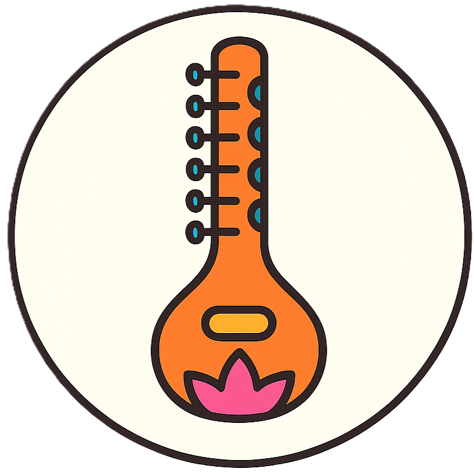

<div align="center">

<div style="margin: 20px 0;">
  
</div>

# 🎵 RAG-Yaman: Advanced Music-Themed Retrieval-Augmented Generation

<div align="center">
    <p>A customized RAG system based on LightRAG with enhanced user experience and music-themed branding</p>
</div>

<div align="center">
  <div style="width: 100%; height: 2px; margin: 20px 0; background: linear-gradient(90deg, transparent, #00d9ff, transparent);"></div>
</div>

<div align="center">
  <div style="background: linear-gradient(135deg, #667eea 0%, #764ba2 100%); border-radius: 15px; padding: 25px; text-align: center;">
    <p>
      <a href='https://github.com/iammhk/RAGaYaman'></a>
      <a href='https://arxiv.org/abs/2410.05779'></a>
      <a href="https://github.com/iammhk/RAGaYaman/stargazers"></a>
    </p>
    <p>
      
      
    </p>
    <p>
      
      
    </p>
  </div>
</div>

</div>

<div align="center" style="margin: 30px 0;">
  
</div>

---

## 🎉 What's New in RAG-Yaman

RAG-Yaman is a customized version of LightRAG with significant enhancements and improvements:

### 🎵 **Enhanced User Experience**
- **Music-Themed Branding**: Complete rebrand with music icons and "RAGai" identity
- **Custom Logo & Favicon**: Personalized branding throughout the application
- **Responsive Login Page**: Enhanced authentication interface with custom styling

### 🔐 **Security & Authentication**
- **User Authentication System**: Secure login with JWT tokens
- **Multi-User Support**: Admin and user account management
- **Session Management**: Configurable token expiration and security settings

### 📝 **Content Creation Features**
- **Built-in Text Document Creator**: Add documents directly from the UI
- **Dialog-Based Interface**: User-friendly forms for content creation
- **Title & Content Management**: Organized document structure with validation

### 🛠 **Technical Improvements**
- **Python 3.13 Support**: Latest Python version compatibility
- **Virtual Environment Setup**: Isolated development environment
- **Enhanced Error Handling**: Improved validation and error messages
- **Consistent Token Management**: Fixed authentication token storage issues

### 🎨 **UI/UX Enhancements**
- **Music3 Icons**: Consistent music-themed iconography
- **Cache-Busting**: Proper favicon and asset loading
- **Responsive Design**: Mobile-friendly interface improvements
- **Enhanced Navigation**: Improved user flow and experience

---

## 🚀 Quick Start

### Prerequisites
- Python 3.13 (recommended)
- Node.js (for WebUI development)
- OpenAI API Key or Ollama for local LLM

### Installation

1. **Clone the Repository**
```bash
git clone https://github.com/iammhk/RAGaYaman.git
cd RAGaYaman
```

2. **Set up Python Environment**
```bash
# Create virtual environment
python -m venv venv

# Activate virtual environment
# Windows:
venv\Scripts\activate
# Linux/Mac:
source venv/bin/activate

# Install dependencies
pip install -e ".[api]"
```

3. **Configure Environment**
```bash
# Copy and configure environment file
cp .env.example .env
# Edit .env with your settings
```

4. **Start the Server**
```bash
lightrag-server
```

The RAG-Yaman interface will be available at `http://localhost:9621`

### Default Login Credentials
- **Username**: `admin`
- **Password**: `admin123`

*Note: Change these credentials in the `.env` file for production use*

---

## ✨ Key Features

### 🎵 **Music-Themed Interface**
- Custom "RAGai" branding with music note icons
- Consistent emerald color scheme
- Enhanced visual identity throughout the application

### 📝 **Document Management**
- **Upload Documents**: Support for PDF, DOC, PPT, CSV files
- **Create Text Documents**: Built-in editor for direct content creation
- **Document Processing**: Automatic knowledge graph generation
- **Batch Operations**: Multiple document handling

### 🔍 **Advanced Query System**
- **Multiple Search Modes**: Local, Global, Hybrid, Mix, Naive
- **Context-Aware Responses**: Conversation history support
- **Real-time Results**: Fast retrieval with caching

### 🕸️ **Knowledge Graph Visualization**
- **Interactive Graph**: Explore entities and relationships
- **Dynamic Layouts**: Multiple visualization options
- **Node Filtering**: Advanced search and filtering capabilities

### 🔐 **Security Features**
- **JWT Authentication**: Secure token-based authentication
- **User Management**: Multiple user accounts with different permissions
- **Session Control**: Configurable token expiration
- **API Key Protection**: Secure API access

---

## 🔧 Configuration

### Environment Variables

Key configuration options in `.env`:

```bash
# Server Configuration
HOST=0.0.0.0
PORT=9621
WEBUI_TITLE='RAGai'
WEBUI_DESCRIPTION="Simple and Fast Graph Based RAG System"

# Authentication (uncomment to enable)
AUTH_ACCOUNTS='admin:admin123,user1:pass456'
TOKEN_SECRET=Your-Key-For-RAG-Yaman-API-Server
TOKEN_EXPIRE_HOURS=48

# LLM Configuration
LLM_MODEL=gpt-4o
LLM_BINDING_HOST=https://api.openai.com/v1
LLM_BINDING_API_KEY=your-openai-api-key

# Embedding Configuration
EMBEDDING_BINDING=ollama
EMBEDDING_MODEL=all-minilm
EMBEDDING_DIM=384
EMBEDDING_BINDING_HOST=http://localhost:11434

# Storage Configuration
RAG_YAMAN_KV_STORAGE=JsonKVStorage
RAG_YAMAN_DOC_STATUS_STORAGE=JsonDocStatusStorage
RAG_YAMAN_GRAPH_STORAGE=NetworkXStorage
RAG_YAMAN_VECTOR_STORAGE=NanoVectorDBStorage
COSINE_THRESHOLD=0.2
```

### Docker Deployment

Use Docker Compose for easy deployment:

```bash
# Build and start services
docker-compose up -d --build

# View logs
docker-compose logs -f

# Stop services
docker-compose down
```

---

## 📖 Usage Examples

### Creating Text Documents

1. **Login** to the RAG-Yaman interface
2. **Navigate** to the Documents tab
3. **Click** "Add Document" button (with music note icon)
4. **Enter** title and content in the dialog
5. **Submit** to create and process the document

### Querying the Knowledge Base

```python
from lightrag import LightRAG, QueryParam

# Initialize RAG-Yaman
rag = LightRAG(working_dir="./rag_storage")

# Query with different modes
response = await rag.query(
    "What are the main themes?",
    param=QueryParam(mode="hybrid")
)
```

### Authentication API

```python
import requests

# Login
response = requests.post("http://localhost:9621/auth/login", 
    json={"username": "admin", "password": "admin123"})
token = response.json()["access_token"]

# Use authenticated endpoints
headers = {"Authorization": f"Bearer {token}"}
documents = requests.get("http://localhost:9621/api/documents", headers=headers)
```

---

## 🛠 Development

### Building the WebUI

```bash
cd lightrag_webui
npm install
npm run build
```

### Running in Development Mode

```bash
# Start backend
lightrag-server

# Start frontend (in another terminal)
cd lightrag_webui
npm run dev
```

### Project Structure

```
RAGaYaman/
├── lightrag/              # Core RAG system
├── lightrag_webui/        # React-based WebUI
│   ├── src/
│   │   ├── components/    # Reusable components
│   │   ├── features/      # Feature-specific components
│   │   ├── api/          # API integration
│   │   └── locales/      # Internationalization
├── data/                  # Data storage
│   ├── inputs/           # Input documents
│   └── rag_storage/      # Processed data
├── assets/               # Project assets
├── docker-compose.yml    # Docker configuration
└── .env                 # Environment configuration
```

---

## 🔗 API Reference

### Authentication Endpoints
- `POST /auth/login` - User login
- `POST /auth/logout` - User logout
- `GET /auth/status` - Check authentication status

### Document Endpoints
- `GET /api/documents` - List documents
- `POST /api/documents/upload` - Upload documents
- `POST /api/documents/text` - Create text document
- `DELETE /api/documents/{id}` - Delete document

### Query Endpoints
- `POST /api/query` - Perform RAG query
- `GET /api/graph` - Get knowledge graph
- `POST /api/extract` - Extract entities and relationships

---

## 🤝 Contributing

We welcome contributions to RAG-Yaman! Here's how you can help:

1. **Fork** the repository
2. **Create** a feature branch (`git checkout -b feature/amazing-feature`)
3. **Commit** your changes (`git commit -m 'Add amazing feature'`)
4. **Push** to the branch (`git push origin feature/amazing-feature`)
5. **Open** a Pull Request

### Development Guidelines

- Follow Python PEP 8 style guide
- Add tests for new features
- Update documentation as needed
- Ensure compatibility with Python 3.13

---

## 📄 License

This project is based on [LightRAG](https://github.com/HKUDS/LightRAG) and maintains the same licensing terms.

---

## 🙏 Acknowledgments

- **LightRAG Team**: For the excellent foundation and core RAG technology
- **Original Paper**: ["LightRAG: Simple and Fast Retrieval-Augmented Generation"](https://arxiv.org/abs/2410.05779)
- **Community**: For feedback and contributions

---

## 📞 Support

- **GitHub Issues**: [Report bugs or request features](https://github.com/iammhk/RAGaYaman/issues)
- **Documentation**: Check the [Wiki](https://github.com/iammhk/RAGaYaman/wiki) for detailed guides
- **Email**: Contact the maintainer for support

---

<div align="center" style="background: linear-gradient(135deg, #667eea 0%, #764ba2 100%); border-radius: 15px; padding: 30px; margin: 30px 0;">
  <div>
    
  </div>
  <div style="margin-top: 20px;">
    <a href="https://github.com/iammhk/RAGaYaman" style="text-decoration: none;">
      
    </a>
    <a href="https://github.com/iammhk/RAGaYaman/issues" style="text-decoration: none;">
      
    </a>
    <a href="https://github.com/iammhk/RAGaYaman/discussions" style="text-decoration: none;">
      
    </a>
  </div>
</div>

<div align="center">
  <div style="width: 100%; max-width: 600px; margin: 20px auto; padding: 20px; background: linear-gradient(135deg, rgba(0, 217, 255, 0.1) 0%, rgba(0, 217, 255, 0.05) 100%); border-radius: 15px; border: 1px solid rgba(0, 217, 255, 0.2);">
    <div style="display: flex; justify-content: center; align-items: center; gap: 15px;">
      <span style="font-size: 24px;">🎵</span>
      <span style="color: #00d9ff; font-size: 18px;">Thank you for using RAG-Yaman!</span>
      <span style="font-size: 24px;">🎵</span>
    </div>
  </div>
</div>
